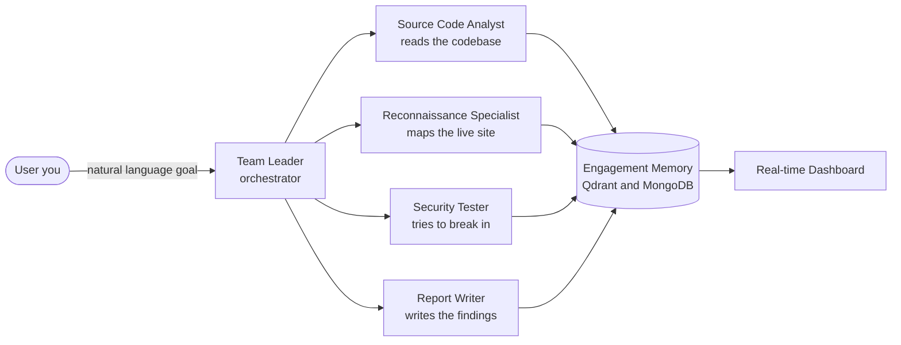
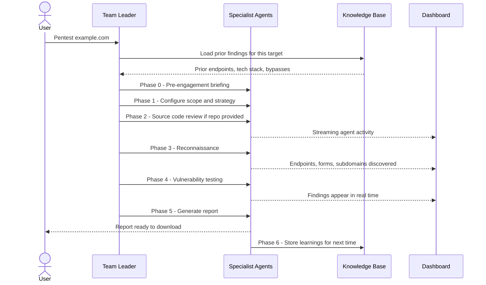
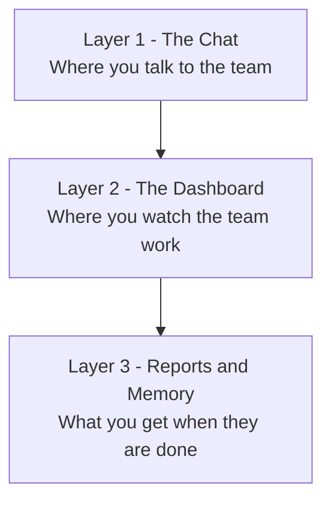
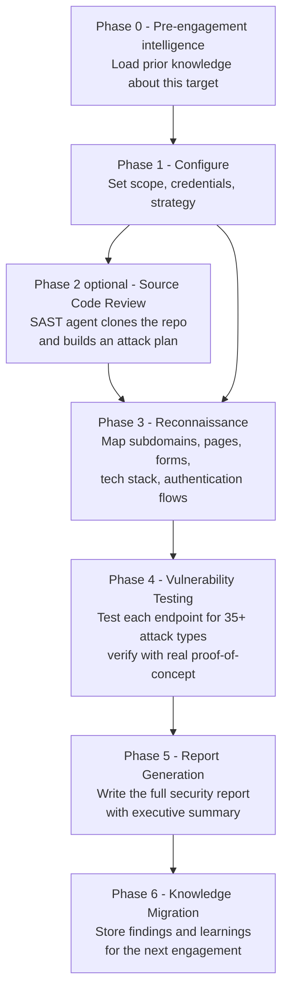
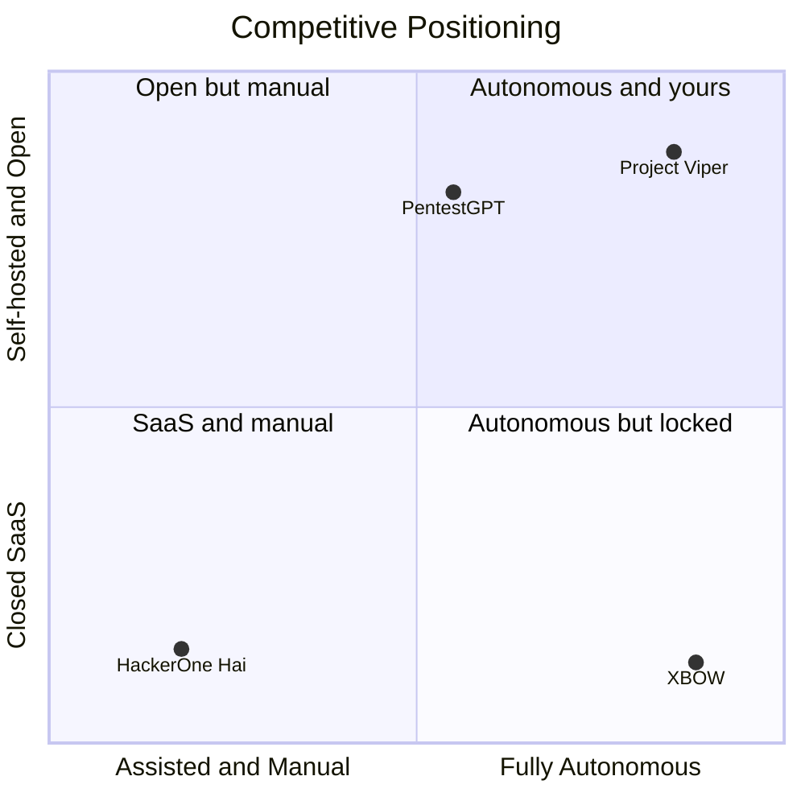
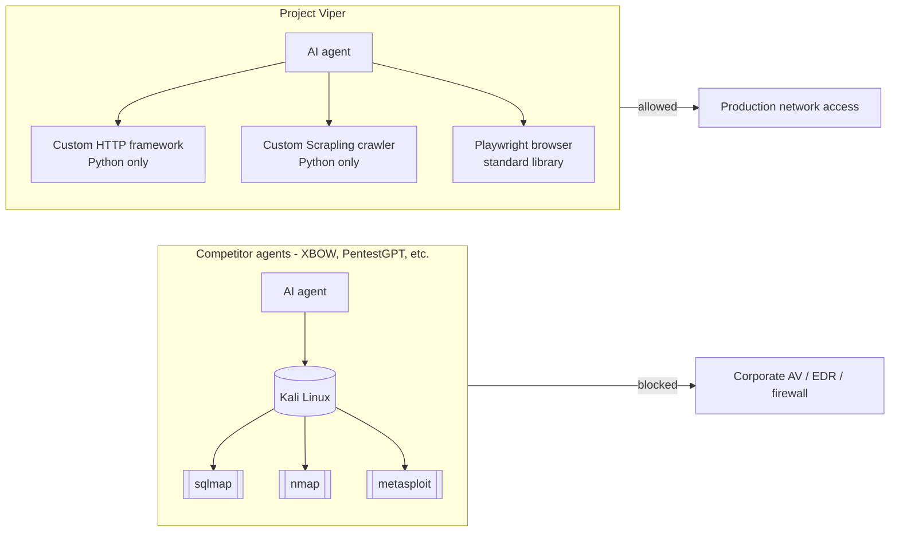
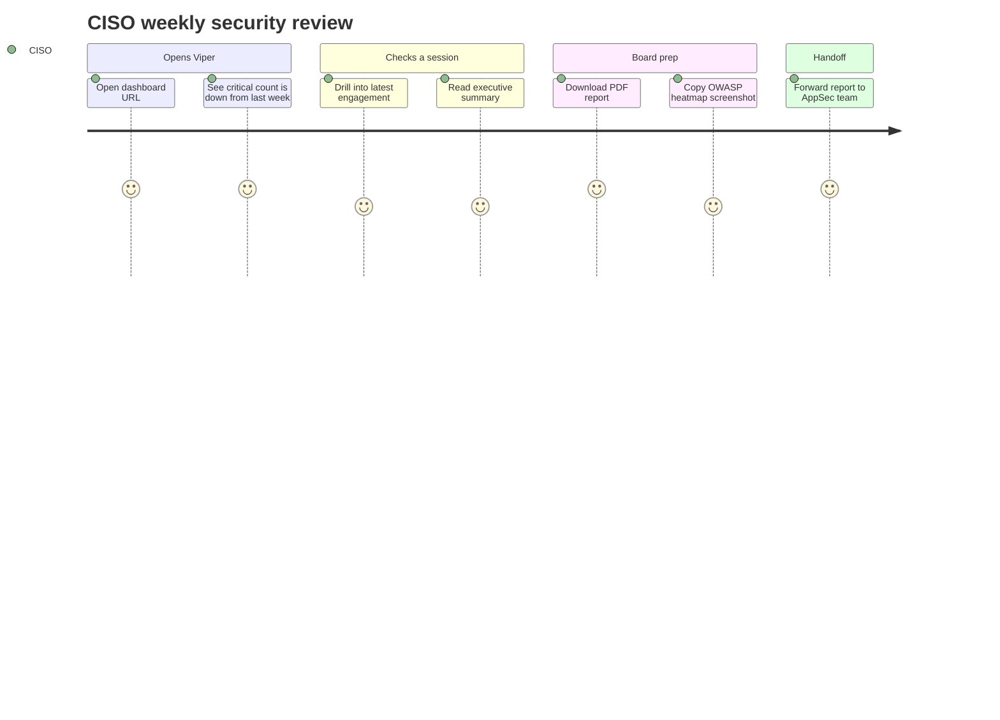
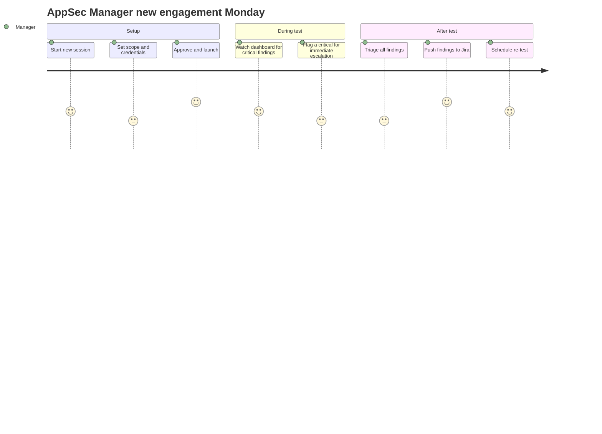
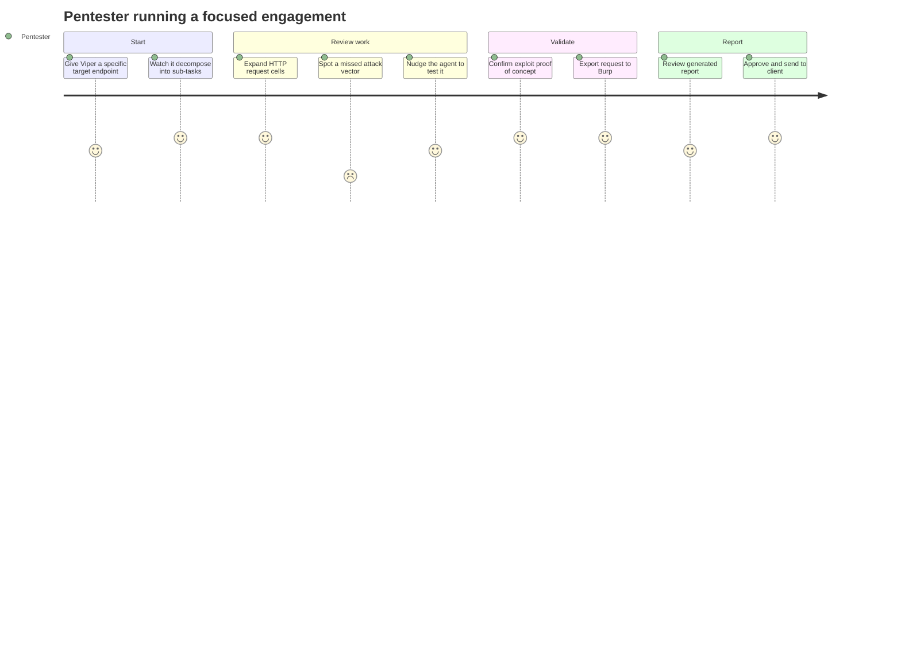
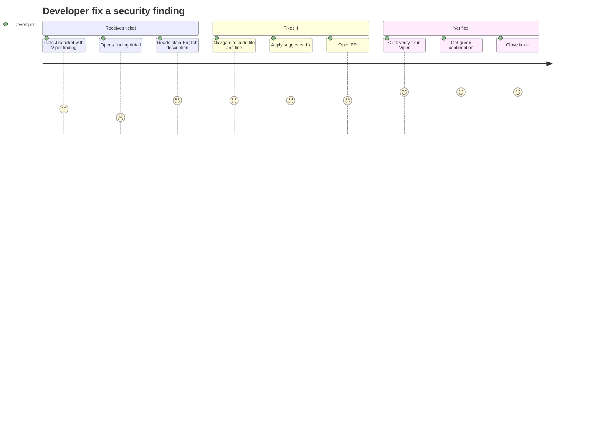

# Project Viper — Designer & Business Brief

> **"Strike every weakness."**

---

## How to use this document

| Your goal | Jump to |
|-----------|---------|
| Pitch Viper to a prospect or investor in 5 minutes | Sections 2, 5, 9 |
| Understand who the product is for before designing | Section 6 |
| Design the UI — know what already exists and what to build | Sections 3, 7, 8 |
| Learn how the product works end-to-end | Sections 2, 4 |
| Look up a security term you don't recognise | Section 10 (Glossary) |
| Find a file in the codebase | Section 11 |

---

## 1. What is Project Viper?

Project Viper is an **AI-powered security testing team** that autonomously attacks web applications to find weaknesses — and then writes a professional report about what it found.

Think of it this way: hiring a security firm to test your website normally takes weeks and costs tens of thousands of dollars. Project Viper does the same job in hours, automatically, with a team of four AI specialists running in your own infrastructure.

> **Analogy.** Imagine a four-person team locked in a room with a website:
> - One person reads all the source code and maps out where the hidden doors are.
> - One person explores the live website like a first-time visitor, drawing a map of everything they can reach.
> - One person tries every trick in the book to break in — SQL tricks, fake login attempts, sneaky file uploads — and documents exactly how they got through.
> - One person takes all the notes and writes a board-ready report.
>
> Project Viper *is* that team. It runs 24/7 without breaks, and you watch it work in real time.

### The four-agent team



The **Team Leader** receives your plain-English instruction (e.g. *"Test https://shop.example.com for login vulnerabilities"*) and decides which specialists to activate and in what order. Every finding, every endpoint discovered, every technique tried is written to shared memory — so all agents learn from each other as the engagement progresses.

### One engagement, start to finish



---

## 2. The product in three layers



### Layer 1 — The Chat (The Pentester's Command Center)

This is where a pentester runs and monitors an engagement. You type a goal in plain English and watch the agents think out loud — every reasoning step, every tool call, every HTTP request they send is displayed as it happens. There is no black box: the pentester can see *exactly why* an agent is making each decision, inspect every packet it sends, and course-correct at any point by typing a follow-up instruction.

Think of it less like a chat app and more like **pair-programming with four elite security engineers who narrate their thinking while they work**.

#### What makes the Chat irreplaceable for a pentester

| Feature | What it looks like | Why pentesters need it |
|---|---|---|
| **Live agent reasoning** | Expandable "thought" blocks before each action | They can verify the agent's logic before it fires a test — not after |
| **Delegation cards** | When the Team Leader hands off to a specialist, a card shows the handoff and which sub-agent picks it up | Pentesters see the orchestration, not just the output |
| **Tool call cells** | Every function the agent calls (crawl, HTTP request, browser action) opens as an expandable row | Full auditability — nothing happens invisibly |
| **HTTP request panels** | Exact request + response shown with syntax highlighting — method, headers, body, status code | Pentesters can inspect, copy as curl, or send straight to Burp Suite |
| **Streaming output** | Agent responses appear token by token, not after a delay | They can cancel mid-run if the agent is going down the wrong path |
| **Nudge / override** | Type a follow-up message at any point to redirect — "Skip subdomains, focus on the /admin panel" | Viper augments their judgment; they stay in control |

#### Full chat wireframe — what a pentester actually sees

```
┌────────────────────────────────────────────────────────────────────────────┐
│  SIDEBAR          │  HEADER                                                │
│                   │  Team: viper-security-team     Session: shop-2026-05   │
│  ⚔ Project Viper  │  [● Connected]  [↺ New Session]  [✕ Cancel Run]       │
│  ──────────────── │  ─────────────────────────────────────────────────── │
│  Dashboard        │                                                        │
│  Chat        ◀──  │  USER                                          09:01   │
│  Knowledge        │  Pentest https://shop.example.com. GitLab repo:        │
│                   │  https://gitlab.example.com/team/shop-backend          │
│  ──────────────── │                                                        │
│  Backend URL      │  TEAM LEADER                                   09:01   │
│  localhost:7777   │  Strategy selected: Code-Assisted Assessment.           │
│  [● Live]         │  I will activate Source Code Analyst first, then        │
│                   │  Reconnaissance, then Security Tester.                  │
│                   │                                                        │
│                   │  ┌─ Source Code Analyst ──────────────────────────┐   │
│                   │  │  [▶ THINKING]  Cloning GitLab repository...    │   │
│                   │  │  Reading route definitions in src/api/...       │   │
│                   │  │  ─────────────────────────────────────────────  │   │
│                   │  │  [▼ Tool call: clone_gitlab_repo]               │   │
│                   │  │    repo_url: https://gitlab.example.com/...     │   │
│                   │  │    Result: Cloned 847 files. 12 routes found.   │   │
│                   │  │  ─────────────────────────────────────────────  │   │
│                   │  │  Found dangerous sink: cursor.execute(query)    │   │
│                   │  │  at src/api/search.py line 89 — unsanitised    │   │
│                   │  │  user input flows directly into SQL query.      │   │
│                   │  └────────────────────────────────────────────────┘   │
│                   │                                                        │
│                   │  ┌─ Security Tester ──────────────────────────────┐   │
│                   │  │  [▶ THINKING]  SAST flagged /api/search as     │   │
│                   │  │  high-risk. Testing SQL injection first.        │   │
│                   │  │  ─────────────────────────────────────────────  │   │
│                   │  │  [▼ HTTP Request]                               │   │
│                   │  │  POST /api/search  HTTP/1.1                     │   │
│                   │  │  Host: shop.example.com                         │   │
│                   │  │  Content-Type: application/json                 │   │
│                   │  │  {"query": "' OR 1=1--"}                       │   │
│                   │  │  ─────────────────────────────────────────────  │   │
│                   │  │  HTTP/1.1 200 OK                                │   │
│                   │  │  {"results": [/* ALL 4,823 products */]}        │   │
│                   │  │  ✓ CONFIRMED: SQL Injection (Critical)          │   │
│                   │  │  [Copy as curl]  [Send to Burp]                 │   │
│                   │  └────────────────────────────────────────────────┘   │
│                   │                                                        │
│                   │  ─────────────────────────────────────────────────    │
│                   │  > Also test the /api/orders endpoint for IDOR  [↑]   │
└────────────────────────────────────────────────────────────────────────────┘
```

The critical detail for your designer: **each coloured block is a different agent**. The Chat is not a single thread — it is a live, multi-actor transcript where each specialist announces itself, reasons out loud, shows its work, and hands off to the next. A pentester reading this transcript gets the same situational awareness as someone sitting in the room with the agents.

### Layer 2 — The Dashboard (Management Command Center)

The Dashboard is built for people who need the big picture without the technical detail. A manager opens it, sees the current state of every active engagement at a glance, drills into any session for a real-time feed of what the agents are doing, and can pull findings reports without once reading the chat.

It has two levels:

**Programme view** — a portfolio overview showing all sessions, aggregate finding counts by severity, and an OWASP category breakdown across all targets. This is the CISO's screen.

**Session view** — a live drill-down into one active engagement. This is the AppSec Manager's or Engagement Lead's screen. It updates automatically via WebSocket — no page refresh needed. Every new finding the agents discover appears on screen within seconds.

#### What makes the Dashboard irreplaceable for management

| Panel | What it shows | Why managers need it |
|---|---|---|
| **Severity KPI cards** | Critical / High / Medium / Low counts, updating live | "Are we more or less exposed than last week?" answered instantly |
| **OWASP radar chart** | Vulnerability distribution mapped to the OWASP Top 10 categories | Risk language the board and compliance teams already understand |
| **Sessions list** | All engagements: name, target, status (live/complete/scheduled), finding count | The full programme at a glance; click any row to drill in |
| **Task timeline** | A horizontal timeline of what the agents are doing, past and present | Shows progress without requiring the manager to read chat logs |
| **Agent activity feed** | A live, auto-scrolling log of what each specialist agent is currently doing | Non-technical managers can watch "the team working" in real time |
| **Vulnerability table** | Every finding, sortable by severity / OWASP category / endpoint / date | Triage, filter, assign — without leaving the dashboard |
| **Finding detail panel** | Slide-over with full finding: description, steps to reproduce, CVSS score, remediation | Click any finding row to read the full details |
| **Negative results** | What the agents tested and *did not* find — intentionally logged | Proves coverage; satisfies compliance auditors asking "did you test X?" |

#### Programme-level dashboard wireframe (CISO / programme view)

```
┌─────────────────────────────────────────────────────────────────────────┐
│  ⚔ CENTRAL INTELLIGENCE HUB              Project Viper   May 2026       │
│  ─────────────────────────────────────────────────────────────────────  │
│                                                                         │
│  ┌──────────────┐  ┌──────────────┐  ┌──────────────┐  ┌────────────┐  │
│  │  CRITICAL    │  │  HIGH        │  │  MEDIUM      │  │  LOW       │  │
│  │              │  │              │  │              │  │            │  │
│  │      3       │  │     12       │  │      8       │  │     4      │  │
│  │  ▼ 2 vs last │  │  ▲ 4 vs last │  │  = same      │  │  ▼ 1      │  │
│  └──────────────┘  └──────────────┘  └──────────────┘  └────────────┘  │
│                                                                         │
│  ┌──────────────────────────────┐  ┌───────────────────────────────┐   │
│  │  OWASP COVERAGE RADAR        │  │  ACTIVE SESSIONS              │   │
│  │                              │  │                               │   │
│  │   Injection ●                │  │  ● shop.example.com   LIVE    │   │
│  │  Broken Auth  ●              │  │    3 critical · 7 high · DAST │   │
│  │    XSS ●                     │  │                               │   │
│  │   SSRF  ●                    │  │  ✓ api.example.com    done    │   │
│  │  ...                         │  │    1 critical · 5 high        │   │
│  │                              │  │                               │   │
│  │   (radar chart)              │  │  ✓ admin.example.com  done    │   │
│  │                              │  │    0 critical · 0 high ✓      │   │
│  └──────────────────────────────┘  └───────────────────────────────┘   │
└─────────────────────────────────────────────────────────────────────────┘
```

#### Session-level dashboard wireframe (AppSec Manager / live monitoring)

```
┌─────────────────────────────────────────────────────────────────────────┐
│  ← All Sessions   shop.example.com    ● LIVE   Phase 4: Vuln Testing    │
│  ─────────────────────────────────────────────────────────────────────  │
│                                                                         │
│  AGENT STATUS                                                           │
│  ┌──────────────┐ ┌──────────────┐ ┌──────────────┐ ┌──────────────┐  │
│  │ 🔍 Recon     │ │ 🎯 Tester    │ │ 📝 Reporter  │ │ 📦 SAST      │  │
│  │  ✓ Complete  │ │  ● Active    │ │  ○ Waiting   │ │  ✓ Complete  │  │
│  │  47 endpoints│ │  /api/orders │ │              │ │  12 risks    │  │
│  └──────────────┘ └──────────────┘ └──────────────┘ └──────────────┘  │
│                                                                         │
│  TASK TIMELINE                                                          │
│  Recon      ████████████████░░░░░░░░░░░░░░░░░  done                    │
│  SAST       ████████░░░░░░░░░░░░░░░░░░░░░░░░░  done                    │
│  Vuln Test  ░░░░░░░░░░░████████████████░░░░░░  in progress  67%        │
│  Report     ░░░░░░░░░░░░░░░░░░░░░░░░░░░░░░░░░  pending                 │
│                                                                         │
│  FINDINGS (live — updates automatically)                                │
│  ┌──────────┬──────────────────────────────┬──────────┬──────────────┐  │
│  │ SEVERITY │ VULNERABILITY                │ ENDPOINT │ OWASP        │  │
│  ├──────────┼──────────────────────────────┼──────────┼──────────────┤  │
│  │ CRITICAL │ SQL Injection                │ /search  │ A03 Injection│  │
│  │ HIGH     │ Broken Object Level Auth     │ /orders/ │ A01 Access   │  │
│  │ HIGH     │ JWT None Algorithm Accepted  │ /api/auth│ A02 Auth     │  │
│  │ MEDIUM   │ Reflected XSS               │ /review  │ A03 Injection│  │
│  └──────────┴──────────────────────────────┴──────────┴──────────────┘  │
│  [Click any row for full finding detail →]                              │
│                                                                         │
│  AGENT ACTIVITY (live feed)                                             │
│  09:14:22  [Security Tester]  Testing /api/orders/{id} for IDOR...      │
│  09:14:19  [Security Tester]  Confirmed: /api/orders/1001 returns        │
│              user data for order belonging to a different account.       │
│  09:14:11  [Security Tester]  Testing /api/auth for JWT weaknesses...    │
│  09:13:58  [Security Tester]  JWT with alg:none accepted. Critical.      │
│                                                                         │
│  NEGATIVE RESULTS (what was tested and found safe)                      │
│  ✓ CSRF protection present on all state-changing endpoints              │
│  ✓ No open redirects found on /login or /oauth callback                 │
└─────────────────────────────────────────────────────────────────────────┘
```

The key design insight here: **the Dashboard and the Chat serve completely different mindsets**. The Chat is a stream of consciousness — noisy, detailed, technical, and intentionally so. The Dashboard is structured signal — clean, prioritised, status-first. A manager should never need to look at the Chat. A pentester should never need to look at the Dashboard to do their job. The design challenge is making both feel native to their respective users while they sit in the same product.

### Layer 3 — Reports and Memory

When the engagement finishes, Viper writes a professional security report: executive summary, full findings with severity ratings, exact steps to reproduce each issue, and remediation advice. It also stores everything it learned about the target — which pages exist, what technology it uses, which attack attempts failed — so the next time you test the same application, it starts from where it left off rather than from scratch.

```
┌─────────────────────────────────────────────────────────────────────┐
│  Reports                             │  Target Memory               │
│                                      │                              │
│  📄 shop.example.com_2026-05-20.md   │  ┌──────────────────────┐   │
│     Executive Summary                │  │  viper_target_{hash} │   │
│     Scope & Methodology              │  │  ────────────────── │   │
│     Critical Findings (3)            │  │  47 endpoints stored │   │
│     High Findings (12)               │  │  3 auth workflows    │   │
│     Remediation Guidance             │  │  2 WAF bypass notes  │   │
│                                      │  │  12 verified findings│   │
│  [Download Markdown]                 │  └──────────────────────┘   │
└─────────────────────────────────────────────────────────────────────┘
```

---

## 3. How it works — one engagement, end to end



| Phase | Plain English | Agent(s) | What you see on screen |
|-------|--------------|----------|------------------------|
| **0 — Intelligence** | Viper checks if it has tested this website before and loads everything it remembers. | Team Leader | Nothing yet — loading spinner in chat |
| **1 — Configure** | Viper reads your goal and decides: full test or targeted test? With source code or without? | Team Leader | First message appears in chat confirming strategy |
| **2 — Source Code** | If you gave Viper the GitLab URL, it reads the code and creates a map of every vulnerable spot to investigate. | Source Code Analyst | Code analysis messages stream in chat; dashboard shows "SAST phase active" |
| **3 — Recon** | Viper explores the website like a detective — finding every page, form, API endpoint, and login flow. | Reconnaissance Specialist | Endpoints list fills up in dashboard; agent messages describe what was found |
| **4 — Vuln Testing** | Viper tries 35+ attack techniques on every endpoint it found. Each finding is documented with proof. | Security Tester | Findings cards appear on dashboard in real time with severity colours |
| **5 — Report** | Viper assembles a professional PDF-ready report with an executive summary and remediation steps. | Report Writer | "Report ready" notification; download link appears |
| **6 — Memory** | Viper saves what it learned — what worked, what failed, every endpoint — for next time. | All agents | Silent background process; confirmation message in chat |

---

## 4. How we compare to the competition

There are a handful of AI penetration testing products on the market. Here is where each sits:



### Side-by-side comparison

| | **Project Viper** | **XBOW** | **PentestGPT** | **HackerOne Hai** |
|---|---|---|---|---|
| **What it does** | Autonomous web app pentesting + source code analysis | Autonomous web app pentesting | AI-assisted pentesting (CTF / research focused) | AI triage assistant for incoming vulnerability reports |
| **Who operates it** | Your security team, internally | You submit a URL; XBOW runs it for you | Security researchers; requires manual guidance | HackerOne platform customers |
| **Where it runs** | Your own servers / Docker | XBOW's cloud (SaaS only) | Open source; runs locally | HackerOne's SaaS platform |
| **Watch it work live?** | Yes — real-time streaming dashboard and chat | No — you get a report after 5 business days | Partially | No |
| **Source code + live test together?** | Yes — SAST feeds the live attack plan | No | No | No |
| **Remembers past engagements?** | Yes — per-target memory in Qdrant vector database | No — every test starts fresh by design | No | No |
| **Compliance-ready report?** | Yes — Markdown report with OWASP, CVSS, CWE mapping | Yes — SOC2 / ISO 27001 / HIPAA compliant | No | No |
| **Price model** | Self-hosted (your infrastructure cost) | From $4,000 per test | Free / open source | Bundled with HackerOne subscription |
| **Data sovereignty** | 100% your network | Leaves your network | Local | HackerOne's servers |
| **Tools required** | Custom Python framework — no external binaries | Kali Linux toolset (sqlmap, nmap, etc.) on XBOW's servers | Kali Linux toolset (sqlmap, nmap, hydra, metasploit) | None — triage only |
| **Runs in restricted / air-gapped environments?** | Yes — no Kali, no flagged binaries, no internet egress required | No — SaaS-only, your data must leave the network | No — requires Kali tooling that most corporate AV/EDR blocks | No — SaaS-only |

### How do we pitch this?

Three angles that resonate with different buyer types:

> **Angle 1 — The on-prem XBOW.**
> "XBOW is the gold standard for autonomous pentesting. Project Viper does everything XBOW does — but it runs on your hardware, your data never leaves your network, and your security team controls every parameter."
> *Use this with: regulated industries (banking, healthcare, government), privacy-conscious buyers.*

> **Angle 2 — XBOW with the curtains open.**
> "With XBOW you submit a URL on Monday and get a PDF on Friday. With Viper you watch it happen — every HTTP request, every payload, every agent decision — in real time. You learn how your app gets attacked, not just that it was."
> *Use this with: technical buyers, pentesters, security engineers who distrust black boxes.*

> **Angle 3 — The only AI pentester that reads the code and tests the live app in one workflow.**
> "Give Viper your GitLab repo and your app URL. The code analyst reads every route, every database call, every authentication check — then hands the vulnerability map to the live tester. That's white-box testing at AI speed."
> *Use this with: development-heavy organisations, AppSec teams with CI/CD pipelines.*

> **Angle 4 — The only AI pentester that runs in restricted environments.**
> "Every other AI pentester depends on Kali Linux tooling — sqlmap, nmap, metasploit. In a bank, a hospital, or a government network, those binaries are blocked by EDR the moment they touch disk. Viper's entire toolchain is custom Python: our own HTTP framework, our own crawler, our own subdomain enumerator. Nothing your security team's AV will flag. Drop the Docker image inside your network and it just works."
> *Use this with: banks, healthcare, defence, government, regulated SaaS, any prospect whose first question is "can we even run this on our infrastructure?"*

### The "no Kali, no problem" advantage

This deserves its own pitch deck slide. Every competitor in the autonomous pentest space — XBOW, PentestGPT, and the long tail of "AI hacker" tools — leans on the standard Kali Linux toolset. That choice is great for personal labs and CTFs. It is a deal-breaker for serious enterprise sales.



**Why this is a moat, not just a feature:**

| Problem with Kali-based competitors | Viper's answer |
|---|---|
| **EDR blocks `sqlmap` / `nmap` on first execution** in any hardened corporate environment. | Viper sends raw HTTP requests using Python's `requests` library. Nothing to detect, nothing to block. |
| **Kali Linux is itself a security policy violation** in many regulated industries (banks, government). Compliance teams will not approve installing it. | Viper ships as a single Docker container with mainstream Python dependencies. Passes a standard software review. |
| **Internet egress required** to download exploit modules / payloads. Most secure networks have no outbound internet from production. | Viper runs fully offline. The knowledge base is seeded once into a local Qdrant instance — no live lookups during a test. |
| **Network noise patterns from Kali tools are well-known to defenders.** Customer's own SOC alerts on the pentest. | Viper's traffic looks like normal HTTP requests — and you can set a custom `Scanner-Header` so the SOC knows it is sanctioned. |
| **Forensic artefacts left behind** by Kali tools (logs, dropped binaries) cause customer cleanup work. | Viper writes no executables to the customer's filesystem. The only output is the report. |

**The one-line elevator pitch for this angle:**

> "Viper is the only AI pentester your customer's compliance team will actually approve."

This single line wins regulated-industry deals that XBOW and PentestGPT cannot reach. For pitches to banks, healthcare, telcos, and government — lead with this.

---

## 5. Target audience — four personas

Viper is one product with four very different types of user. The UI needs to feel "home" for each of them without making the others feel lost.

---

### Persona 1 — The CISO / VP Security

**Who they are:** Board-facing executive responsible for the company's security posture. Thinks in risk, compliance, and business impact. Rarely logs in; mostly consumes reports and dashboards.

**What keeps them up at night:** "If we get breached, I have to explain to the board why we didn't know. I need to show we are actively testing — and improving."

**What they want from Viper:**
- A KPI summary they can screenshot for a board slide: total findings, trend over time, most-exposed apps.
- Compliance mapping: "Which of these findings put us out of SOC2? ISO 27001?"
- A PDF they can email without editing it.
- Nothing that requires understanding SQL injection.

**What "seamless" looks like:**
- They open a URL, land on the dashboard, see the three numbers they care about (Critical / High / Medium), download a report, and close the browser.
- Zero configuration. Zero technical jargon in the dashboard copy.

**Which surface they live in:** Parent dashboard — the programme-level overview.



---

### Persona 2 — The AppSec Manager / Engagement Lead

**Who they are:** Runs the security programme day to day. Schedules tests, reviews findings, hands them off to development teams, tracks remediation progress. The operations hub of the security team.

**What keeps them up at night:** "We have 40 applications and two pentesters. How do I make sure everything gets tested on the right cycle? And how do I get developers to actually fix what we find?"

**What they want from Viper:**
- A session list with status: scheduled, running, complete, re-test pending.
- Scope and approval controls before a test fires.
- Findings triage: accept risk, assign to a developer, mark as false positive.
- Integration with Jira or Linear so findings become tickets automatically.
- Re-test scheduling: "Run this test again after the dev team pushes the fix."

**What "seamless" looks like:**
- Scheduling a new test takes under two minutes.
- Findings go straight to Jira with one click.
- Dashboard shows remediation rate alongside discovery rate.

**Which surface they live in:** Session list + session detail dashboard.



---

### Persona 3 — The Pentester / Operator

**Who they are:** Hands-on security professional. May use Viper to accelerate their own manual testing, or to run parallel coverage while they focus on harder targets. Highly technical. Deeply suspicious of "magic" they can't inspect.

**What keeps them up at night:** "Does this AI actually understand what it's doing, or is it just grepping for obvious stuff? I need to trust the methodology before I put my name on the report."

**What they want from Viper:**
- Full visibility: every HTTP request and response, every payload sent, every tool call made.
- The ability to nudge: "The agent just skipped blind SQLi — go back and test that."
- Raw request export (copy as curl command, send to Burp Suite).
- Payload library: what 35 attack types does Viper know? Can I add custom ones?
- Manual override for scope — "Also test these three endpoints it missed."

**What "seamless" looks like:**
- Chat feels like pair-programming with an expert. Not like a chatbot.
- Every tool call is expandable with full request/response detail.
- Nothing is hidden behind a "Viper is thinking…" spinner.

**Which surface they live in:** Chat — primarily the tool-call cells and HTTP request panels.



---

### Persona 4 — The Developer (design opportunity — surface does not exist yet)

**Who they are:** Software engineer who wrote the code being tested. Receives findings from the security team. Has never done a pentest. Does not know what "IDOR" means. Wants to fix the bug and move on.

**What keeps them up at night:** "Security sends me a PDF with 40 findings and no code references. I have no idea which file to change."

**What they want from Viper:**
- Per-finding remediation: "The bug is in `UserController.java`, line 142. Here is the fix."
- A "verify my fix" button that re-runs the specific test after the patch.
- Code snippets they can paste, not abstract advice.
- Integration with their GitLab / GitHub pull request — findings as PR comments.
- No security jargon. "Insecure Direct Object Reference" should say "You're not checking if the logged-in user actually owns the resource they're requesting."

**What "seamless" looks like:**
- Developer opens a link from a Jira ticket. Sees one finding. Sees the exact file and line number. Sees a code fix. Clicks "Verify fix." Gets a green tick. Closes the ticket.
- They never need to open the Viper dashboard at all.

**Which surface they live in:** A Developer Portal that does not exist yet — this is the single biggest design opportunity in the product.



---

## 6. Current visual identity — what exists today

Before designing, understand what is already there. This section is a visual inventory of the current UI so you know what to keep, what to evolve, and what to throw away.

### Colour palette

| Token / Role | Dark theme value | Light theme | Notes |
|---|---|---|---|
| App background | `#18181b` | `#f4f4f5` | Near-black zinc |
| Sidebar background | `#111113` | `#e4e4e7` | Slightly darker than app |
| Card background | `#27272a` | `#ffffff` | Raised surface |
| Primary text | `#ffffff` | `#09090b` | |
| Secondary text | `#8a8a8e` | `#71717a` | Muted labels |
| Active nav accent | `red-500` (`#ef4444`) | same | Viper's current brand red |
| Dashboard accent | `indigo-500` (`#6366f1`) | same | Hub header, live streams |
| Critical severity | `rose-500` | same | Finding severity: critical |
| High severity | `orange-500` | same | Finding severity: high |
| Medium severity | `yellow-500` | same | Finding severity: medium |
| Low severity | `emerald-500` | same | Finding severity: low |
| Live / connected | `green-400` (`#4ade80`) | same | Backend connection dot |
| Border / divider | white at 8–12% opacity | black at 8% opacity | Subtle separation |

### Typography

| Use | Font | Style |
|---|---|---|
| All UI copy | Inter (Google Fonts) | Regular / Medium / Semibold |
| Dashboard micro-labels | JetBrains Mono or Fira Code | Uppercase, 9–11px, `letter-spacing: widest` |
| Code / HTTP request panels | JetBrains Mono / system monospace | 12–14px |
| Chat markdown | Inter for prose; mono for code blocks | Standard markdown rendering |

### Layout structure

```
┌───────────────────────────────────────────────────────────────┐
│  Outer canvas: #111113, full viewport                         │
│                                                               │
│  ┌─────────────┐  ┌────────────────────────────────────────┐  │
│  │  Sidebar    │  │  Main card                             │  │
│  │  ~195px     │  │  Rounded corners (lg)                  │  │
│  │  Collapsible│  │  Border: white at 10% opacity          │  │
│  │             │  │  Background: #27272a                   │  │
│  │  Red active │  │                                        │  │
│  │  nav item   │  │  Active view renders here              │  │
│  │             │  │  (Chat / Dashboard / Knowledge)        │  │
│  └─────────────┘  └────────────────────────────────────────┘  │
└───────────────────────────────────────────────────────────────┘
```

### What is implemented today vs. what is stubbed

| Surface | Status | Notes |
|---|---|---|
| Chat | Live, wired to backend | Full streaming, multi-agent tree, HTTP request panels |
| Dashboard — programme view | Partially live (mock data) | Severity counts, OWASP radar, session list |
| Dashboard — session detail | Partially live (mock data) | Vulnerability table, task timeline, agent activity feed |
| Knowledge browser | Live | Table of RAG knowledge items with preview |
| Evaluation | Navigation item exists | "Coming Soon" badge |
| Sessions / Traces / Metrics | Defined but no view | Shows "Access Restricted" if reached |
| Developer portal | Does not exist | Design opportunity — see Section 8 |
| Mobile / responsive | Not designed | All current layout is desktop-first |

### Motion

The dashboard uses `motion/react` for:
- Panel transitions when switching between sessions.
- Vulnerability detail slide-over from the right.
- Entry animations on finding cards.

The chat uses no animation library — message rendering is plain DOM updates.

---

## 7. Design opportunities and directives

These are the five things that would make Project Viper's design stand out from any other security tool on the market.

---

### 1. A signature visual identity beyond "dark dashboard"

**The problem:** The current design is clean, professional, and completely forgettable. It could be any SaaS security product from 2022. There is no single visual element that says "Viper."

**The opportunity:** Own one motif. It could be the snake-fang as a logo glyph. A venom-green accent that replaces the generic red. A coiling/uncoiling animation for loading states that subtly references a snake striking. A distinctive monogram for the four agents.

```
Today:            With a signature motif:
─────────────     ──────────────────────────────────
Generic dark      Same dark base — but every loading
sidebar, red      indicator is a coiling snake,
nav accent,       the agent icons have a fang glyph,
standard cards.   and the brand accent is a venomous
                  acid-green (#a3e635 or similar).
                  "Oh, that's Viper" — from 10 feet away.
```

Ask yourself: what does a viper look like when it's hunting? That movement, that precision, that stillness-then-strike — that is the product experience. Make it visible.

---

### 2. A Developer surface (does not exist yet — open ground)

**The problem:** Developers receive a Markdown report and have to figure out the rest themselves. No competitor has solved this well.

**The opportunity:** A dedicated developer view — accessible via a share link from a finding — that shows:
- The vulnerable code file and line number (from the SAST agent).
- A plain-English description with no jargon.
- A suggested code fix in the same language as their codebase.
- A "Verify my fix" button that re-runs only that one test.
- A status indicator: Open → Fix Submitted → Verified.

```
┌─────────────────────────────────────────────────────────────┐
│  🐍 Viper Finding  #VPR-041              [● Open]           │
│  SQL Injection — /api/search                                │
│  ─────────────────────────────────────────────────────────  │
│  What this means                                            │
│  An attacker can steal all data in your database by         │
│  typing a special character into the search box.            │
│                                                             │
│  Where it is in your code                                   │
│  📄 src/api/SearchController.java : line 89                 │
│                                                             │
│  How to fix it                                              │
│  [code snippet with the parameterised query fix]            │
│                                                             │
│  [  Verify my fix  ]    [  Open in GitLab  ]                │
└─────────────────────────────────────────────────────────────┘
```

---

### 3. An executive surface that prints well

**The problem:** CISOs need to bring Viper into a board meeting. Screenshots of a dark web app do not project well. And there is no print stylesheet.

**The opportunity:**
- A light-mode "executive view" toggle that reformats the dashboard for a projector or printed slide.
- A one-click "Board Summary" PDF that has: logo, date, three headline numbers, the OWASP heatmap, and top three recommendations. No raw finding details. Printable on one A4 page.
- Compliance badges on the report: "3 critical findings affect SOC2 CC6.1."

---

### 4. Real-time storytelling — make the hunt visible

**The problem:** The dashboard shows data. It does not tell a story. A security test is actually a thrilling, intelligent hunt — but watching the current dashboard, you would not know it.

**The opportunity:** Show the agents as characters, not as anonymous log entries.

```
┌──────────────────────────────────────────────────────────────┐
│  🔍 Recon       🎯 Tester       📝 Reporter     📦 SAST      │
│  ● Mapping API  ● Testing auth  ○ Waiting       ○ Waiting    │
│                                                              │
│  Attack surface map (live graph):                            │
│                                                              │
│      [login] ─── tested ✓ ─── [dashboard]                   │
│          \                          │                        │
│           └─── [/api/users] ◀── probing now                 │
│                                                              │
│  3 critical findings  ████████░░  67% complete              │
└──────────────────────────────────────────────────────────────┘
```

An animated attack-surface graph that grows as recon discovers new nodes, and turns red as the tester finds issues — this alone would be a demo moment that no competitor can match.

---

### 5. An onboarding empty state that demos itself

**The problem:** A first-time user opens Viper, sees an empty chat, and has no idea what to type.

**The opportunity:** The product already has a sample-conversation feature in `UI/App.tsx`. This should become a proper "Watch a demo engagement" button:
- Click once: Viper runs a fake engagement against a demonstration target.
- The chat populates with realistic agent messages.
- The dashboard fills with real-looking findings.
- At the end: "Ready to test a real target? Enter your URL above."

This doubles as your sales demo — run it in front of a prospect and they immediately understand the product without you explaining anything.

---

## 8. Brand pillars

Pin these above your monitor. Every design decision should reinforce at least one of these.

| Pillar | What it means for design |
|--------|--------------------------|
| **Autonomous** | The UI should convey activity and intelligence, not emptiness. Loading states are never blank — agents are always visibly "thinking" or "hunting." |
| **Transparent** | Nothing is hidden. Every action the AI takes is viewable. No black box. Design that openness in — expandable tool calls, full request/response access. |
| **Hybrid** | The product bridges code analysis and live testing. Visually link the two — SAST findings should feel connected to the live vulnerability that confirmed them. |
| **Memory** | Viper gets smarter with each engagement. Show this — a "prior engagement" badge on targets, a timeline that spans multiple tests, a "Viper already knows this app" confirmation. |
| **On your turf** | Self-hosted, private, under your control, no flagged tooling. The design should feel enterprise-grade and serious — like software a bank's compliance team would actually approve. Professional typography, precise data presentation, never cutesy. |

---

## 9. Glossary

A plain-English definition for every security term used in this document. Use these in any pitch or demo.

| Term | Plain-English definition |
|------|--------------------------|
| **Penetration test (pentest)** | Hiring someone to try to break into your system to find weaknesses before a real attacker does. |
| **DAST** | Dynamic Application Security Testing — testing the website or app *while it is running*, like a locksmith trying every door on a building. |
| **SAST** | Static Application Security Testing — reading the source *code* before running it, looking for dangerous patterns, like a building inspector reviewing blueprints before construction. |
| **Vulnerability** | A weakness in a website or app that could be exploited by an attacker. |
| **Finding** | One documented vulnerability: what it is, how severe it is, how to reproduce it, and how to fix it. |
| **Engagement** | One complete security test of one target application, from start to report. |
| **Scope** | The agreed boundary of the test — which URLs, domains, and features are allowed to be tested. |
| **Exploit** | Successfully taking advantage of a vulnerability to prove it is real. |
| **Payload** | A specially crafted input sent to a website to test whether it is vulnerable (e.g. `' OR 1=1--` is a SQL injection payload). |
| **Recon / Reconnaissance** | The discovery phase — mapping out everything about a target before trying to attack it. Like casing a building before a heist. |
| **OWASP Top 10** | A widely respected list of the ten most critical web application security risks, published by a non-profit organisation. Viper covers all ten. |
| **CVSS** | A 0–10 score for how severe a vulnerability is. 9–10 = critical; 7–8.9 = high; 4–6.9 = medium; 0–3.9 = low. |
| **CWE** | Common Weakness Enumeration — a standardised numbered catalogue of software weakness types (e.g. CWE-89 = SQL Injection). Used in compliance reporting. |
| **SQLi (SQL Injection)** | An attack where a hacker types database commands into a form field to steal or delete data. One of the oldest and most common attacks. |
| **XSS (Cross-Site Scripting)** | An attack where a hacker plants malicious JavaScript in a website that then runs in other users' browsers. |
| **SSRF** | Server-Side Request Forgery — tricking the server into making requests to internal systems it should not expose. |
| **IDOR** | Insecure Direct Object Reference — accessing data belonging to another user by changing a number in a URL (e.g. changing `/orders/1001` to `/orders/1002` to see someone else's order). |
| **WAF** | Web Application Firewall — a security layer in front of a website that tries to block malicious requests. Viper knows how to test whether WAFs can be bypassed. |
| **RAG** | Retrieval-Augmented Generation — a technique where the AI looks up relevant reference material before answering. Viper uses this to query 171 technique guides before testing each vulnerability type. |

---

## 10. Where to find things in the codebase

If you want to look under the hood, here is a map. You do not need to read code — these pointers are for when you want to understand a specific behaviour before designing it.

| What you want to understand | File to look at |
|---|---|
| The literal words each agent says and its personality | `Backend/core/prompts.py` |
| Every attack type Viper knows how to test | `Backend/skills/vuln/` (35 skill files, one per attack type) |
| The main application shell (outer layout, routing, theming) | `UI/App.tsx` |
| The current dashboard — programme-level view | `UI/components/dashboard/DashboardView.tsx` |
| The current chat view — messages, tool calls, streaming | `UI/components/ChatArea.tsx` |
| The sidebar navigation | `UI/components/Sidebar.tsx` |
| Dashboard data components (charts, tables, timeline) | `UI/components/dashboard/DataComponents.tsx` |
| All colour tokens and CSS variables | `UI/index.html` (`:root` block) and `UI/index.css` |
| The API — every endpoint the backend exposes | `Backend/api/routes.py` |
| The four-agent team definition and configuration | `Backend/core/agent.py` |
| The knowledge base content (attack technique guides) | `Backend/knowledge/viper_knowledge/pentesting-web/` |

---

*Document prepared for internal design onboarding — Project Viper, May 2026.*
*All product facts in this document are traceable to the source files listed in Section 10.*
*Competitor facts sourced from public material at xbow.com, github.com/GreyDGL/PentestGPT, and hackerone.com.*
